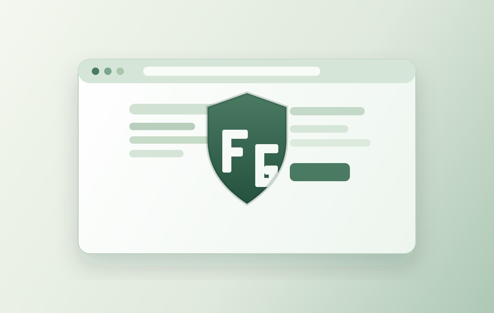
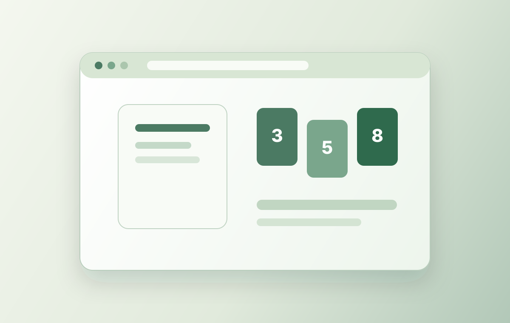
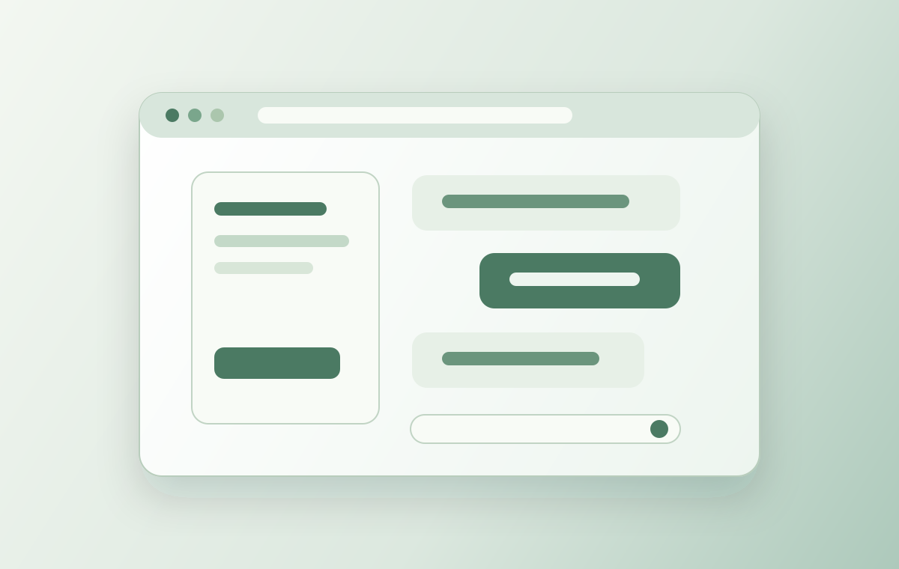
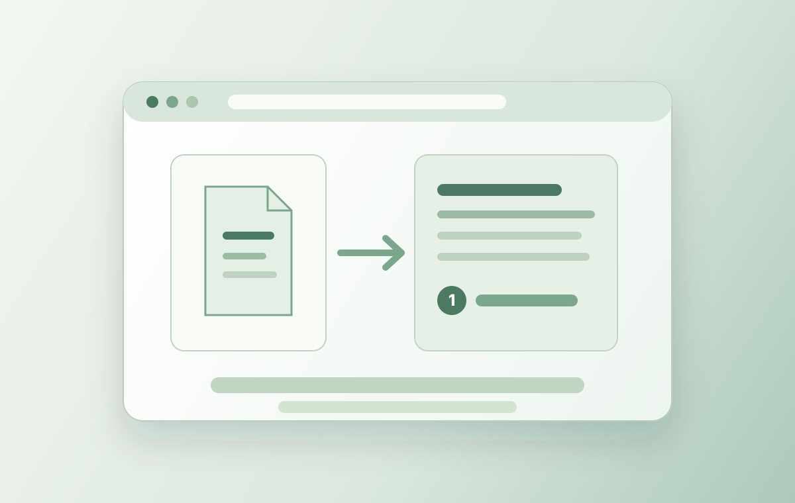
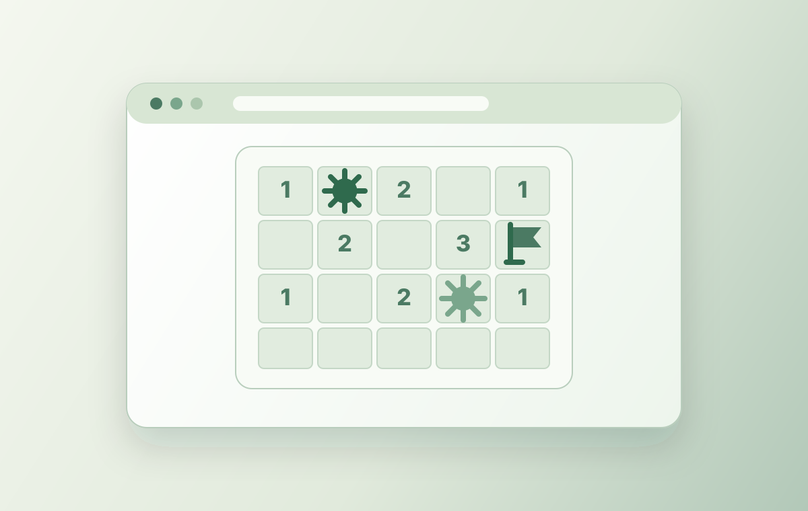

<h2 align="center">Find me online</h2>

<table>
  <tr>
    <td width="25%" align="center" valign="top" title="My personal website for digital products, public projects, professional content, and important links.">
       
      <strong><a href="https://kereszteszsolt.hu/">kereszteszsolt.hu</a></strong>
    </td>
    <td width="25%" align="center" valign="top" title="Professional profile and networking.">
       
      <strong><a href="https://www.linkedin.com/in/kereszteszsolt">LinkedIn: @kereszteszsolt</a></strong>
    </td>
    <td width="25%" align="center" valign="top" title="Updates, thoughts, and sharing content.">
       
      <strong><a href="https://x.com/KeresztesZsolti">X (Twitter): @KeresztesZsolti</a></strong>
    </td>
    <td width="25%" align="center" valign="top" title="If you find my content or shared code useful, you can support me on my Buy Me a Coffee page. Your support is completely optional and comes with no obligation or reward – it’s simply a way to show appreciation for my work.">
       
      <strong><a href="https://www.buymeacoffee.com/kereszteszsolt">Buy Me A Coffee: @kereszteszsolt</a></strong>
    </td>
  </tr>
  <tr>
    <td width="25%" align="center" valign="top" title="Short, concise, and easy-to-understand self-improvement and STEM* content in Hungarian. (*) STEM: Science, Technology, Engineering, and Math">
       
      <strong><a href="https://www.youtube.com/@KeresztesZsolt">YouTube: @KeresztesZsolt</a></strong>
    </td>
    <td width="25%" align="center" valign="top" title="Short, concise, and easy-to-understand self-improvement and STEM* content in English, with occasional videos in Romanian and German. (*) STEM: Science, Technology, Engineering, and Math">
       
      <strong><a href="https://www.youtube.com/@KeresztesZsolti">YouTube: @KeresztesZsolti</a></strong>
    </td>
    <td width="25%" align="center" valign="top" title="Short, concise, and easy-to-understand self-improvement and STEM* content in Hungarian. (*) STEM: Science, Technology, Engineering, and Math">
       
      <strong><a href="https://www.tiktok.com/@kereszteszsolti">TikTok: @kereszteszsolti</a></strong>
    </td>
    <td width="25%" align="center" valign="top" title="Short, concise, and easy-to-understand self-improvement and STEM* content in English, sometimes in Romanian and German as well. (*) STEM: Science, Technology, Engineering, and Math">
       
      <strong><a href="https://www.tiktok.com/@kereszteszsoltie">TikTok: @kereszteszsoltie</a></strong>
    </td>
  </tr>
</table>

<h2 align="center">Products</h2>

<table width="100%">
  <tr>
    <td width="50%" align="center" valign="top" title="A local-first new tab workspace for organizing links into screens, groups, and folders with configurable search, icons, and backgrounds.">
       
      <strong><a href="https://pinusmaximus.com/">Pinus Maximus</a></strong>  
      <a href="https://pinusmaximus.com/">Website</a> ·
      <a href="https://chromewebstore.google.com/detail/pinus-maximus/ljggjjecdefhnidfdggfnekmohnknapd">Chrome Web Store</a> ·
      <a href="https://addons.mozilla.org/en-US/firefox/addon/pinus-maximus/">Firefox Add-ons</a>
    </td>
    <td width="50%" align="center" valign="top" title="A focus helper that blocks distracting websites with a deliberate message so it is easier to return to intentional work.">
       
      <strong><a href="https://chromewebstore.google.com/detail/focus-guard/bdfnblnbjckkhknignkpmckeelfplill?utm_source=ext_app_menu">Focus Guard</a></strong>  
      <a href="https://chromewebstore.google.com/detail/focus-guard/bdfnblnbjckkhknignkpmckeelfplill?utm_source=ext_app_menu">Chrome Web Store</a> ·
      <a href="https://github.com/kereszteszsolt/PA_Focus_Guard">GitHub</a>
    </td>
  </tr>
</table>

<h2 align="center">Selected Projects</h2>

<table width="100%">
  <tr>
    <td width="33.33%" align="center" valign="top" title="A focus helper that blocks distracting websites so it is easier to return to intentional work.">
       
      <strong><a href="https://github.com/kereszteszsolt/PA_Focus_Guard">Focus Guard</a></strong> 
      <a href="https://github.com/kereszteszsolt/PA_Focus_Guard">GitHub</a>
    </td>
    <td width="33.33%" align="center" valign="top" title="A Vue 3 and TypeScript app for generating, solving, and playing Queens-style logic puzzles.">
       
      <strong><a href="https://github.com/kereszteszsolt/crown-grid">CrownGrid</a></strong> 
      <a href="https://github.com/kereszteszsolt/crown-grid">GitHub</a>
    </td>
    <td width="33.33%" align="center" valign="top" title="A real-time Planning Poker app for collaborative team estimation.">
       
      <strong><a href="https://github.com/kereszteszsolt/planning-poker">Planning Poker</a></strong> 
      <a href="https://github.com/kereszteszsolt/planning-poker">GitHub</a>
    </td>
  </tr>
  <tr>
    <td width="33.33%" align="center" valign="top" title="A local-first Angular chat client for private conversations with Ollama models.">
       
      <strong><a href="https://github.com/kereszteszsolt/local-nook-ai">Local Nook AI</a></strong> 
      <a href="https://github.com/kereszteszsolt/local-nook-ai">GitHub</a>
    </td>
    <td width="33.33%" align="center" valign="top" title="A local-first RAG app for grounded conversations with persistent documents and source citations.">
       
      <strong><a href="https://github.com/kereszteszsolt/cite-nook-ai">Cite Nook AI</a></strong> 
      <a href="https://github.com/kereszteszsolt/cite-nook-ai">GitHub</a>
    </td>
    <td width="33.33%" align="center" valign="top" title="A classic Minesweeper game built with HTML, CSS, and JavaScript.">
       
      <strong><a href="https://github.com/zsoltkeresztes/PP_minesweeper">Minesweeper</a></strong> 
      <a href="https://github.com/zsoltkeresztes/PP_minesweeper">GitHub</a>
    </td>
  </tr>
</table>
